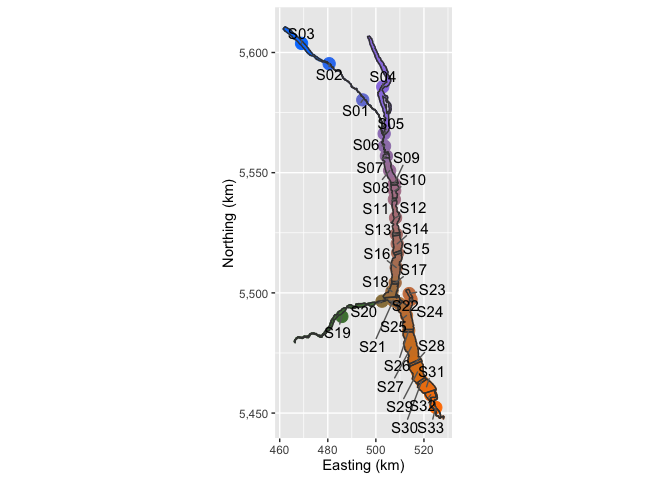
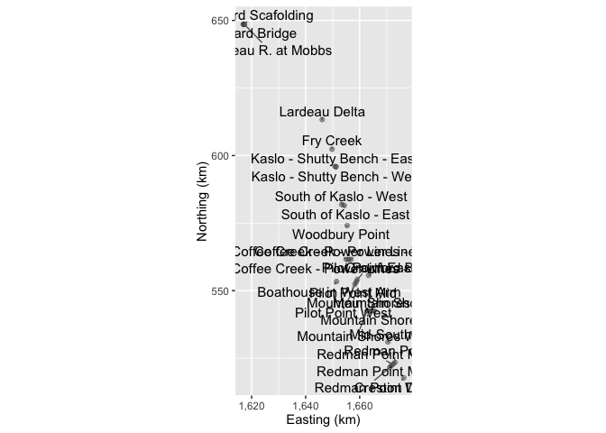
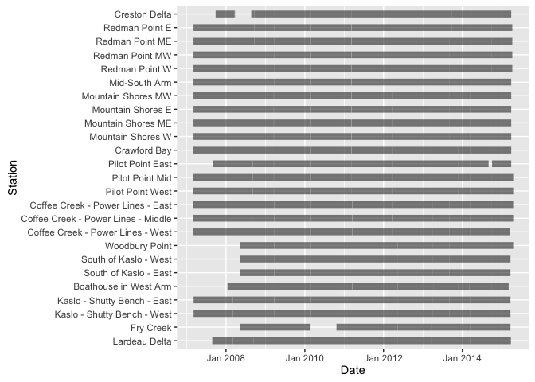
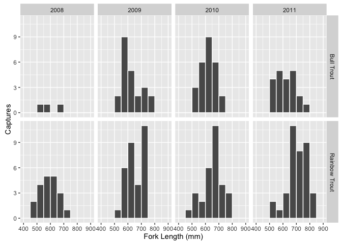
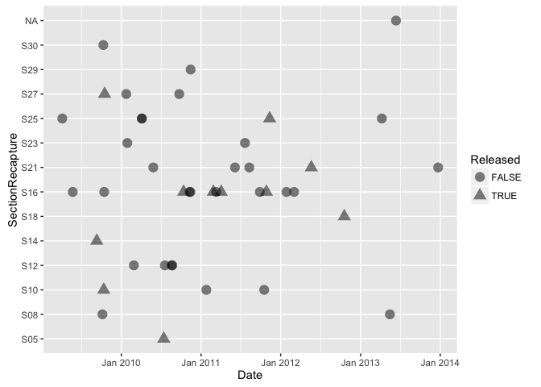
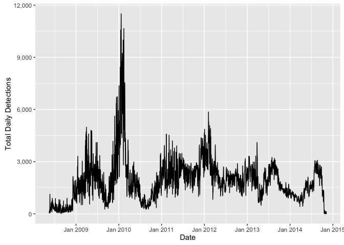
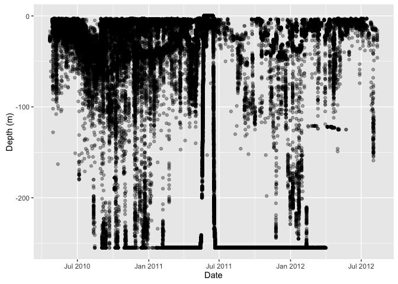
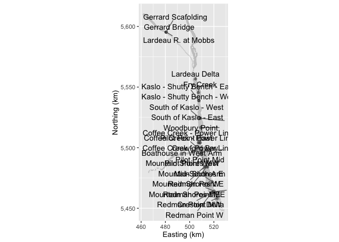
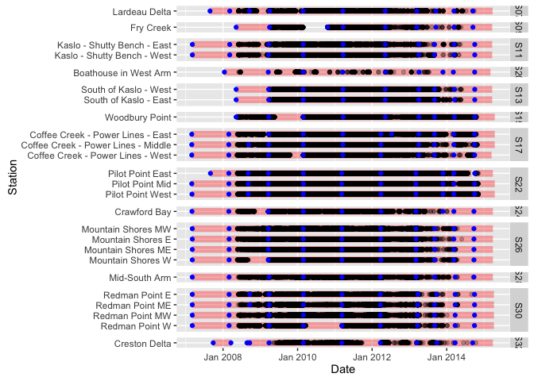
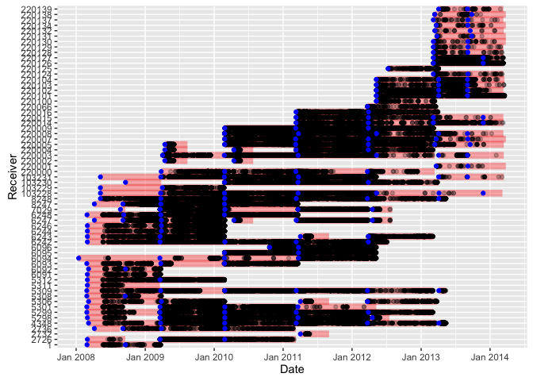

<!-- README.md is generated from README.Rmd. Please edit that file -->
Kootenay Lake Exploitation Study Data

An R package of data for the Kootenay Lake Large Trout Exploitation Study

    Data sets in package ‘klexdatr’:

    capture                          Fish Capture Data
    deployment                       Receiver Deployment Data
    depth                            Acoustic Depth Data
    detection                        Acoustic Detection Data
    recapture                        Fish Recapture Data
    section                          Section Data
    station                          Station Data

``` r
library(dplyr)
#> 
#> Attaching package: 'dplyr'
#> The following objects are masked from 'package:stats':
#> 
#>     filter, lag
#> The following objects are masked from 'package:base':
#> 
#>     intersect, setdiff, setequal, union
library(lexr)
#> 
#> Attaching package: 'lexr'
#> The following object is masked from 'package:base':
#> 
#>     date
library(klexdatr)

lex <- input_lex_data("klexdatr")

print(lex)
#> $section
#> Source: local data frame [33 x 5]
#> 
#>    Section Habitat Bounded EastingSection NorthingSection
#>     (fctr)  (fctr)   (lgl)          (dbl)           (dbl)
#> 1      S03  Lentic    TRUE       469091.4         5603774
#> 2      S02  Lentic    TRUE       480563.8         5595333
#> 3      S04  Lentic    TRUE       502869.0         5585727
#> 4      S01  Lentic    TRUE       494545.9         5580270
#> 5      S05  Lentic    TRUE       503461.2         5566212
#> 6      S06  Lentic    TRUE       503599.0         5561065
#> 7      S07  Lentic    TRUE       504379.6         5556931
#> 8      S08  Lentic    TRUE       505733.3         5550877
#> 9      S09  Lentic    TRUE       507685.1         5545409
#> 10     S10  Lentic    TRUE       507829.3         5542442
#> ..     ...     ...     ...            ...             ...
#> 
#> $station
#> Source: local data frame [28 x 4]
#> 
#>                        Station Section EastingStation NorthingStation
#>                         (fctr)  (fctr)          (dbl)           (dbl)
#> 1          Lardeau R. at Mobbs     S02       480847.0         5595246
#> 2           Gerrard Scafolding     S02       480626.0         5595336
#> 3               Gerrard Bridge     S02       480380.0         5595360
#> 4                Lardeau Delta     S07       504927.0         5556704
#> 5                    Fry Creek     S09       507092.4         5545461
#> 6  Kaslo - Shutty Bench - West     S11       507853.0         5538758
#> 7  Kaslo - Shutty Bench - East     S11       507390.0         5538898
#> 8        South of Kaslo - East     S13       508997.0         5524158
#> 9        South of Kaslo - West     S13       508102.0         5524630
#> 10              Woodbury Point     S15       509139.0         5516639
#> ..                         ...     ...            ...             ...
#> 
#> $deployment
#> Source: local data frame [197 x 4]
#> 
#>                                Station Receiver  DateTimeReceiverIn
#>                                 (fctr)   (fctr)              (time)
#> 1                   Gerrard Scafolding     2736 2008-04-06 11:00:00
#> 2                       Gerrard Bridge     6247 2008-04-06 11:00:00
#> 3                  Lardeau R. at Mobbs     8247 2008-04-06 11:00:00
#> 4                        Lardeau Delta     6092 2008-03-06 12:00:00
#> 5                        Lardeau Delta     5308 2008-09-16 11:00:00
#> 6          Kaslo - Shutty Bench - West     4348 2008-03-06 12:00:00
#> 7          Kaslo - Shutty Bench - East     5306 2008-03-06 12:00:00
#> 8                       Woodbury Point     8248 2008-05-08 11:00:00
#> 9    Coffee Creek - Power Lines - East     6093 2008-02-26 12:00:00
#> 10 Coffee Creek - Power Lines - Middle     5308 2008-02-26 12:00:00
#> ..                                 ...      ...                 ...
#> Variables not shown: DateTimeReceiverOut (time)
#> 
#> $capture
#> Source: local data frame [191 x 10]
#> 
#>    Capture     DateTimeCapture SectionCapture    Species Length Weight
#>     (fctr)              (time)         (fctr)     (fctr)  (int)  (dbl)
#> 1     F075 2008-05-24 10:40:00            S25 Bull Trout    545   1.75
#> 2     F076 2008-05-24 11:10:00            S25 Bull Trout    654   3.40
#> 3     F084 2008-06-05 08:01:00            S16 Bull Trout    553     NA
#> 4     F100 2009-05-02 13:31:00            S21 Bull Trout    643   2.75
#> 5     F104 2009-05-03 11:17:00            S22 Bull Trout    567   2.00
#> 6     F129 2009-05-07 09:11:00            S21 Bull Trout    703   3.90
#> 7     F133 2009-05-07 13:58:00            S21 Bull Trout    712   3.65
#> 8     F137 2009-05-08 11:16:00            S21 Bull Trout    572   1.90
#> 9     F141 2009-05-20 15:13:00            S16 Bull Trout    564   2.20
#> 10    F143 2009-05-21 08:00:00            S16 Bull Trout    595   2.40
#> ..     ...                 ...            ...        ...    ...    ...
#> Variables not shown: Reward1 (int), Reward2 (int), DateTimeTagExpire
#>   (time), DepthRangeTag (int)
#> 
#> $recapture
#> Source: local data frame [42 x 8]
#> 
#>      DateTimeRecapture Capture SectionRecapture TBarTag1 TBarTag2
#>                 (time)  (fctr)           (fctr)    (lgl)    (lgl)
#> 1  2009-04-05 12:00:00    F006              S25     TRUE     TRUE
#> 2  2009-05-23 12:00:00    F131              S16     TRUE     TRUE
#> 3  2009-09-10 12:00:00    F097              S14     TRUE     TRUE
#> 4  2009-10-06 12:00:00    F169              S08     TRUE     TRUE
#> 5  2009-10-10 12:00:00    F076              S30     TRUE     TRUE
#> 6  2009-10-12 12:00:00    F099              S10     TRUE     TRUE
#> 7  2009-10-14 12:00:00    F112              S16     TRUE     TRUE
#> 8  2009-10-16 12:00:00    F111              S27     TRUE     TRUE
#> 9  2010-01-23 12:00:00    F197              S27     TRUE     TRUE
#> 10 2010-01-28 12:00:00    F075              S23     TRUE     TRUE
#> ..                 ...     ...              ...      ...      ...
#> Variables not shown: TagsRemoved (lgl), Released (lgl), Public (lgl)
#> 
#> $detection
#> Source: local data frame [325,715 x 4]
#> 
#>      DateTimeDetection Capture Receiver Detections
#>                 (time)  (fctr)   (fctr)      (int)
#> 1  2012-12-30 18:00:00    F379   220102          5
#> 2  2012-12-31 17:00:00    F379   220009         14
#> 3  2012-12-31 18:00:00    F379   220009         11
#> 4  2012-12-31 19:00:00    F379   220009          5
#> 5  2012-12-31 22:00:00    F379   220009          4
#> 6  2012-12-31 23:00:00    F379   220009          3
#> 7  2013-01-01 05:00:00    F379   220009          3
#> 8  2013-01-02 02:00:00    F379   220009          7
#> 9  2013-01-02 15:00:00    F379   220009          5
#> 10 2013-01-03 09:00:00    F379   220125          3
#> ..                 ...     ...      ...        ...
#> 
#> $depth
#> Source: local data frame [214,816 x 4]
#> 
#>          DateTimeDepth Capture Receiver Depth
#>                 (time)  (fctr)   (fctr) (dbl)
#> 1  2010-04-21 13:26:35    F214   220008    25
#> 2  2010-04-21 13:32:06    F214   103230    25
#> 3  2010-04-21 13:33:15    F214   103230    25
#> 4  2010-04-21 13:34:28    F214   103230    25
#> 5  2010-04-21 13:35:52    F214   103230    25
#> 6  2010-04-21 13:37:36    F214   103230    25
#> 7  2010-04-21 13:40:00    F214   103230    25
#> 8  2010-04-21 13:43:16    F214   220008    25
#> 9  2010-04-21 13:44:06    F214   103230    25
#> 10 2010-04-21 13:47:18    F214   220008    25
#> ..                 ...     ...      ...   ...
#> 
#> attr(,"class")
#> [1] "lex_data"

plot(lex, all = TRUE)
```

<!-- --><!-- --><!-- --><!-- --><!-- --><!-- --><!-- --><!-- --><!-- --><!-- -->

Installation
------------

Then execute the following code at the R terminal:

``` r
# install.packages("devtools")
devtools::install_github("poissonconsulting/klexdatr")
```

Acknowledgements
----------------


The project was primarily funded by the Habitat Conservation Trust Foundation.

The Habitat Conservation Trust Foundation was created by an act of the legislature to preserve, restore and enhance key areas of habitat for fish and wildlife throughout British Columbia. Anglers, hunters, trappers and guides contribute to the projects of the Foundation through licence surcharges. Tax deductible donations to assist in the work of the Foundation are also welcomed.

The project was partially funded by the Fish and Wildlife Compensation Program on behalf of its program partners BC Hydro, the Province of B.C., Fisheries and Oceans Canada, First Nations and the public who work together to conserve and enhance fish and wildlife impacted by the construction of BC Hydro dams.

Annual operation and maintenance for VR2W arrays used in this study were completed by Ministry of Forests, Lands and Natural Resource Operations (MFLNRO) and funded by the Fish and Wildlife Compensation Program (FWCP) in conjunction with the Bonneville Power Administration (BPA) through the Northwest Power and Conservation Council’s Fish and Wildlife Program, in co-operation with the Idaho Department of Fish and Game (IDFG), and the Kootenai Tribe of Idaho (KTOI). The Freshwater Fish Society of British Columbia (FFSBC) provided tag rewards.
