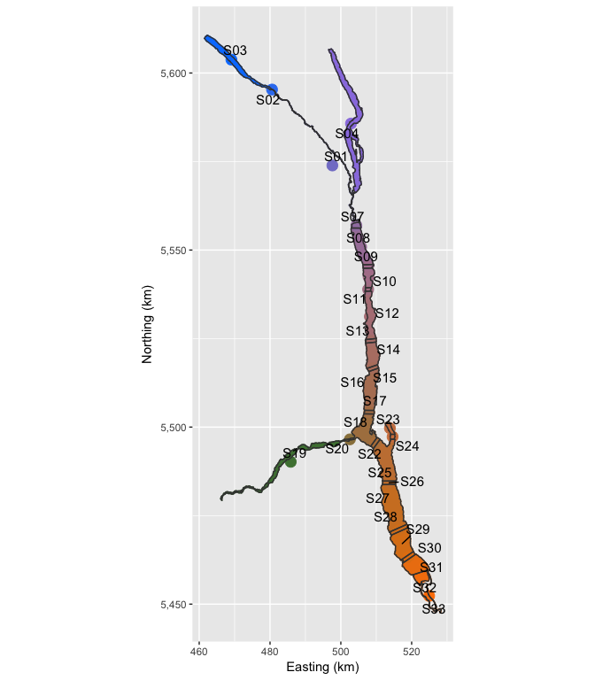

<!-- README.md is generated from README.Rmd. Please edit that file -->
[](https://github.com/joethorley/stability-badges#locked) [](https://travis-ci.org/poissonconsulting/klexdatr) [](https://ci.appveyor.com/project/poissonconsulting/klexdatr) [](https://codecov.io/gh/poissonconsulting/klexdatr) [](https://creativecommons.org/publicdomain/zero/1.0/legalcode) [](https://doi.org/10.5281/zenodo.596624)

Kootenay Lake Exploitation Study Data
=====================================

An R package of data for the Kootenay Lake Large Trout Exploitation Study. The package provides six related datasets.

The data is analysed by

**Thorley, J.L.**, and **Andrusak, G.F. 2017.** *The fishing and natural mortality of large, piscivorous Bull Trout and Rainbow Trout in Kootenay Lake, British Columbia (2008–2013)*. PeerJ 5: e2874. <https://peerj.com/articles/2874>.

If you use the data in your own publications please cite <http://doi.org/10.5281/zenodo.596624>

    capture                          Fish Capture Data
    deployment                       Receiver Deployment Data
    detection                        Acoustic Detection Data
    recapture                        Fish Recapture Data
    section                          Section Data
    station                          Station Data

The following plots of the data were produced using the [lexr](https://github.com/poissonconsulting/lexr) package. 


Installation
------------

To install and load the klexdatr package, execute the following code at the R terminal:

``` r
# install.packages("devtools")
devtools::install_github("poissonconsulting/klexdatr")
library(klexdatr)
```

Information
-----------

For more information, install and load the package and then type `?klexdatr` at the R terminal.

Acknowledgements
----------------


The project was primarily funded by the Habitat Conservation Trust Foundation.

The Habitat Conservation Trust Foundation was created by an act of the legislature to preserve, restore and enhance key areas of habitat for fish and wildlife throughout British Columbia. Anglers, hunters, trappers and guides contribute to the projects of the Foundation through licence surcharges. Tax deductible donations to assist in the work of the Foundation are also welcomed.

The project was partially funded by the Fish and Wildlife Compensation Program on behalf of its program partners BC Hydro, the Province of B.C., Fisheries and Oceans Canada, First Nations and the public who work together to conserve and enhance fish and wildlife impacted by the construction of BC Hydro dams.

Annual operation and maintenance for VR2W arrays used in this study were completed by Ministry of Forests, Lands and Natural Resource Operations (MFLNRO) and funded by the Fish and Wildlife Compensation Program (FWCP) in conjunction with the Bonneville Power Administration (BPA) through the Northwest Power and Conservation Council’s Fish and Wildlife Program, in co-operation with the Idaho Department of Fish and Game (IDFG), and the Kootenai Tribe of Idaho (KTOI). The Freshwater Fish Society of British Columbia (FFSBC) provided tag rewards.
